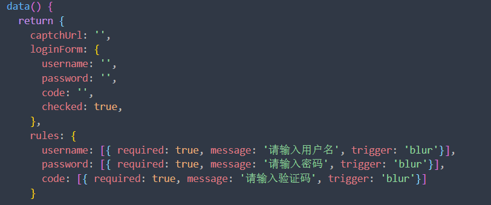

# From表单验证报错：[Element Warn][Form]model is required for validate to work!

1. `<el-from>`标签里不是使用的`module`而是使用`v-module`导致的。
2. `<el-form-item>`标签里没有使用`v-module`导致的。
3. `<el-form-item>`标签里`prop`参数命名没有和`<el-from>`标签里`module`数据源对象里的一致。
4. 总结：
   1. 表单域属性：
      * :relus：表单项属性prop必须是relus对象里的属性
      * ref：用来标识表单域
      * :model：表单项属性 v-model 必须是model对象里面的属性
