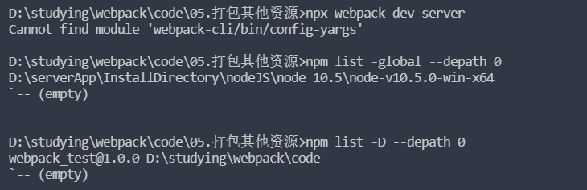
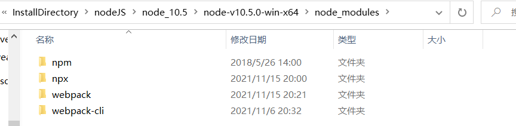
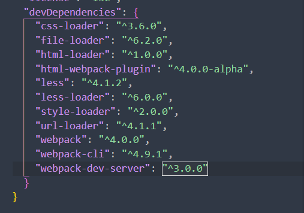
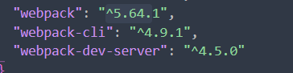
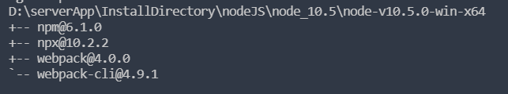

### error：Cannot find module 'webpack-cli/bin/config-yargs'

---

error reappear：

why

propertity analyse about the error:

1. 目前webpack-dev-server@3.0.0版本太低不支持webpack@4.0.0
2. webpack4.0以上版本都要安装webpack-cli
3. right now, 卸载掉所有的 webpack webpack-cli webpack-dev-server。重新一起安装，记住是**同时安装**。

way to resolve: `$ npm uninstall webpack webpack-cli webpack-dev-server -D `。

看看开发依赖的版本： `$ npm list -D --depth=0`

现在又有好玩的事了，还记得前面说的 `$ npm list -g --depth=0` 和 `$ npm list -g --depth=0`显示为 empty 吗。现在他又回来了：

有点意思
